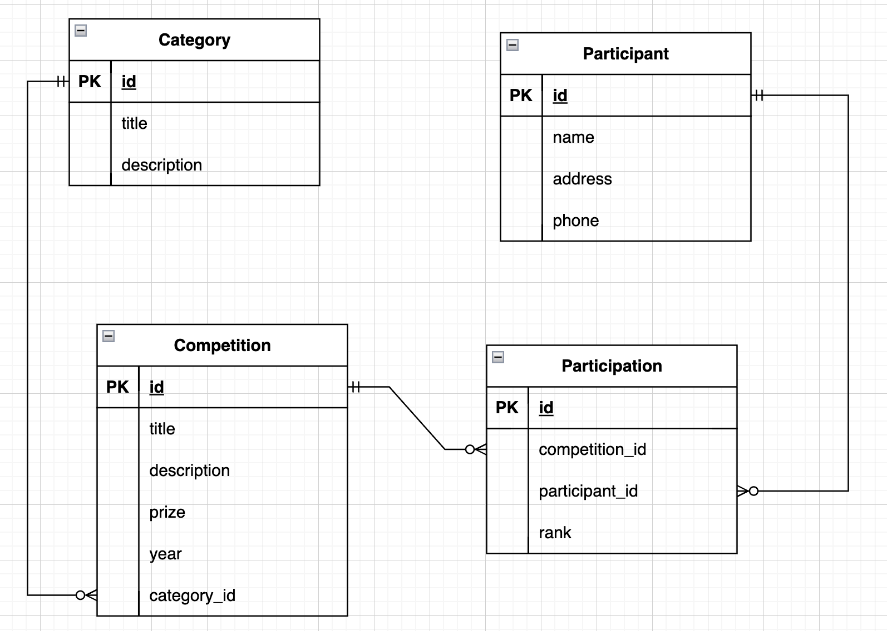

# build_api Ed Lessons Module 4

## Overview of the API
In this lesson, we will start building an API with similar functionality but with a modular structure.
What we are trying to build is an API for keeping track of participants and competitions.

0. Virtual environment - connected and actived
```bash
python3 -m venv venv && source venv/bin/activate
```

1. create a database
- Connect to postgres
```bash
sudo -u postgres psql
```
- create a database
```
CREATE DATABASE jan_lms_db;
```
- see all database in the system -> \l
- see all users int he system -> \du
- connect to a database -> \c [database_name]
- see all tables -> \dt

- create user
```
CREATE USER jan_lms_dev PASSWORD '123456';
```
- grant privileges to database
```
GRANT ALL PRIVILEGES ON DATABASE jan_lms_dev TO jan_lms_dev;
```
- grant privileges to schema, (to find schemas name \dn)
```
GRANT ALL PRIVILEGES ON SCHEMA public TO jan_lms_dev;
```
- connect to database \c databasename

2. Models
we will have two models for now: Competition (such as FIFA world cup, Olympic, Australian Football League, etc.) and Participant (any person who participates in the competition).

33. ERD - Flask Associations

